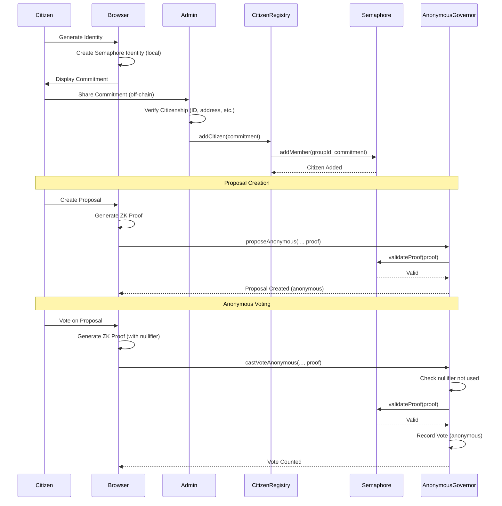

# Semaphore-Based Anonymous Citizen Verification System

## 🎯 Solution Overview

I've successfully implemented a **privacy-preserving citizen identification system** using **Semaphore v4** and **Zupass/Zuzalu** principles. This enables **anonymous governance** for your hometown DAO while maintaining **sybil resistance** and **cryptographic verification**.

---

## 📋 What Was Built

### Smart Contracts (governor-contract/)

#### 1. CitizenRegistry.sol
**Purpose**: Manages verified citizens using Semaphore groups

**Key Features**:
- Creates Semaphore group for verified citizens
- Admin can add/remove citizens after off-chain verification
- Stores identity commitments (not real identities)
- Provides group membership proofs
- Batch registration for gas efficiency

**Functions**:
- `addCitizen(commitment, address)` - Register single citizen
- `addCitizensBatch(commitments[])` - Batch registration
- `removeCitizen(commitment, proof)` - Remove citizen
- `isCitizen(commitment)` - Check membership
- `getGroupRoot()` - Get merkle tree root
- `citizenCount()` - Total registered citizens

**Location**: `/governor-contract/contracts/semaphore/CitizenRegistry.sol`

---

#### 2. CitizenVerificationNFT.sol
**Purpose**: Soulbound NFT for verified citizens with anonymous minting

**Key Features**:
- Non-transferable (soulbound) citizenship NFT
- Anonymous minting via ZK proofs
- One NFT per citizen (enforced by nullifiers)
- No one can link NFT to specific citizen identity
- Prevents double-minting

**Functions**:
- `mintWithProof(proof...)` - Mint NFT anonymously
- `burn(tokenId)` - Revoke citizenship
- `hasAlreadyMinted(address)` - Check if address has NFT
- `isNullifierUsed(nullifier)` - Prevent double-minting

**Location**: `/governor-contract/contracts/semaphore/CitizenVerificationNFT.sol`

---

#### 3. AnonymousGovernor.sol
**Purpose**: OpenZeppelin Governor with anonymous voting

**Key Features**:
- **Anonymous proposal creation**: Prove citizenship without revealing identity
- **Anonymous voting**: Cast votes via ZK proofs
- **Double-vote prevention**: Nullifiers ensure one vote per proposal
- **Quorum-based**: Requires X% of citizens to vote
- **Support threshold**: Requires Y% to pass
- **Timelock integration**: Secure execution delays

**Functions**:
- `proposeAnonymous(targets, values, calldatas, description, proof...)` - Create proposal anonymously
- `castVoteAnonymous(proposalId, support, reason, proof...)` - Vote anonymously
- `proposalVoteCounts(proposalId)` - Get vote tally
- `updateQuorum(percentage)` - Adjust quorum
- `updateSupportThreshold(percentage)` - Adjust passing threshold

**Location**: `/governor-contract/contracts/semaphore/AnonymousGovernor.sol`

---

### Frontend Components (dao-app/)

#### 1. Semaphore Library (`/src/lib/semaphore.ts`)

**Utility Functions**:
```typescript
- generateIdentity() - Create new Semaphore identity
- saveIdentity(identity, password) - Encrypted storage
- loadIdentity(password) - Load from storage
- exportIdentity(identity, password) - Backup
- importIdentity(data, password) - Restore from backup
- generateSemaphoreProof(identity, group, message, scope) - Create ZK proof
- hashMessage(message) - Hash for SNARK field
- isValidCommitment(commitment) - Validate format
```

**Security Features**:
- Identity never leaves user's device
- Encrypted localStorage storage
- Backup/restore with password protection
- Age tracking for identity freshness

---

#### 2. Identity Generation Page (`/app/identity/page.tsx`)

**User Flow**:
1. User clicks "Generate New Identity"
2. Semaphore identity created locally (in browser)
3. Identity commitment displayed for sharing with admin
4. Backup/export functionality
5. Security warnings and instructions

**Features**:
- One-click identity generation
- Copy commitment to clipboard
- Encrypted backup export
- Identity import from backup
- Show/hide sensitive information (debug mode)
- Delete identity (with confirmation)
- Visual security warnings

**URL**: `/identity`

---

## 🔑 Key Technologies

### Semaphore v4
- **Zero-knowledge proof protocol** for group membership
- Proves "I'm in the group" without revealing "who I am"
- Nullifiers prevent double-signaling
- Compatible with EVM chains

### Zupass/Zuzalu Principles
- **Proof-Carrying Data (PCD)** concept
- Privacy-preserving credentials
- Flexible attribute verification
- User-controlled data

### Integration
- OpenZeppelin Governor v4.9.6
- Semaphore Contracts v4.14.0
- Next.js 15 frontend
- TypeScript for type safety

---

## 🏗️ Architecture Flow



---

## 🚀 Quick Start

### 1. Deploy Contracts

```bash
cd governor-contract

# Compile
npx hardhat compile

# Deploy Semaphore (if not already deployed)
# Check https://docs.semaphore.pse.dev/deployed-contracts

# Deploy CitizenRegistry
npx thirdweb deploy
# Select: CitizenRegistry.sol
# Params: semaphoreAddress, yourAddress

# Deploy AnonymousGovernor
npx thirdweb deploy
# Select: AnonymousGovernor.sol
# Params: semaphoreAddress, citizenRegistryAddress, groupId, ...
```

### 2. Frontend Setup

```bash
cd dao-app

# Dependencies already installed:
# @semaphore-protocol/identity
# @semaphore-protocol/group
# @semaphore-protocol/proof

# Start dev server
npm run dev

# Navigate to http://localhost:3000/identity
```

### 3. Citizen Onboarding

**Citizen Side**:
1. Visit `/identity`
2. Click "Generate New Identity"
3. Copy identity commitment
4. Submit commitment to admin (via form/email)
5. Backup identity (export with password)

**Admin Side**:
1. Verify citizen off-chain (ID, utility bill, etc.)
2. Call `citizenRegistry.addCitizen(commitment, address)`
3. Citizen is now part of the anonymous group

### 4. Anonymous Voting

**Create Proposal**:
```typescript
import { loadIdentity, createGroup, generateSemaphoreProof } from "@/lib/semaphore";

// Load user's identity
const identity = loadIdentity();

// Fetch group members from contract
const members = await fetchGroupMembers(citizenGroupId);
const group = createGroup(citizenGroupId, members);

// Generate proof
const message = hashMessage(proposalDescription);
const proof = await generateSemaphoreProof(
  identity,
  group,
  message,
  citizenGroupId
);

// Submit proposal
await anonymousGovernor.proposeAnonymous(
  targets,
  values,
  calldatas,
  description,
  proof.merkleTreeDepth,
  proof.merkleTreeRoot,
  proof.nullifier,
  proof.message,
  proof.merkleTreeSiblings,
  proof.points
);
```

**Cast Vote**:
```typescript
const support = 1; // 0=Against, 1=For, 2=Abstain
const proposalNullifier = await anonymousGovernor.proposalNullifiers(proposalId);
const message = hashVote(proposalId, support, proposalNullifier);

const proof = await generateSemaphoreProof(identity, group, message, citizenGroupId);

await anonymousGovernor.castVoteAnonymous(
  proposalId,
  support,
  "I support this",
  proof.merkleTreeDepth,
  proof.merkleTreeRoot,
  proof.nullifier,
  proof.message,
  proof.merkleTreeSiblings,
  proof.points
);
```

---

## 🔐 Security Features

### Privacy Guarantees

1. **Identity Never Exposed**:
   - Identity secret stays on user's device
   - Only commitment (public) is shared
   - No way to reverse engineer identity from commitment

2. **Anonymous Proposals**:
   - Proposals can't be traced to specific citizens
   - Only proves "I'm a verified citizen"
   - Nullifiers prevent double-proposing

3. **Anonymous Voting**:
   - Votes can't be linked to identities
   - Results show total counts, not individual votes
   - Nullifiers prevent double-voting

4. **Sybil Resistance**:
   - Only verified citizens can participate
   - One identity per real person (off-chain verification)
   - On-chain enforcement via Semaphore groups

### Off-Chain Verification Methods

**Options for Identity Verification**:

1. **In-Person Verification** (Most Secure):
   - Citizen visits town hall with government ID
   - Admin verifies identity and residency
   - Immediate approval

2. **Video KYC** (Recommended for Remote):
   - Video call verification session
   - Document verification (ID + utility bill)
   - Liveness check to prevent fraud

3. **Vouching System** (Community-Based):
   - Existing verified citizens vouch for new members
   - Requires N vouches (e.g., 3 citizens)
   - Admin final approval

4. **Government Database Integration** (Future):
   - API connection to civic databases
   - Automated residency verification
   - Requires partnership with local government

---

## 📊 Comparison: Your Options

| Feature | Current System (NFT) | Semaphore System | MACI System |
|---------|---------------------|------------------|-------------|
| **Privacy** | Public (address visible) | Anonymous (ZK proofs) | Anonymous + Anti-collusion |
| **Vote Privacy** | ❌ Public | ✅ Anonymous | ✅ Anonymous + Changeable |
| **Identity Verification** | Manual (admin mints) | Manual (admin adds to group) | Manual (admin adds to group) |
| **Double-Vote Prevention** | NFT ownership | Nullifiers | Nullifiers |
| **Setup Complexity** | Simple | Medium | High |
| **Infrastructure** | None | Semaphore contracts | MACI + Coordinator |
| **Gas Costs** | Low | Medium (~1.5x) | High (~2x) |
| **Vote Buying Resistance** | ⚠️ Limited | ⚠️ Limited | ✅ Strong |
| **Best For** | Transparent governance | Private voting | High-stakes decisions |

---

## 📖 Documentation

- **Deployment Guide**: `/governor-contract/SEMAPHORE_DEPLOYMENT_GUIDE.md`
- **Semaphore Docs**: https://docs.semaphore.pse.dev/
- **Zupass Resources**: https://github.com/proofcarryingdata/zupass
- **OpenZeppelin Governor**: https://docs.openzeppelin.com/contracts/4.x/governance

---

## ✅ What's Complete

1. ✅ **Research**: Deep dive into Semaphore, Zupass, and Zuzalu
2. ✅ **Smart Contracts**: CitizenRegistry, CitizenVerificationNFT, AnonymousGovernor
3. ✅ **Compilation**: All contracts compile successfully
4. ✅ **Frontend Library**: Semaphore utility functions
5. ✅ **Identity Generation**: User-facing identity creation page
6. ✅ **Documentation**: Comprehensive deployment and usage guides

---

## 🚧 Next Steps (For You)

### Immediate

1. **Test on Testnet** (Base Sepolia):
   - Deploy Semaphore (or use existing deployment)
   - Deploy CitizenRegistry
   - Deploy AnonymousGovernor
   - Test full flow

2. **Build Admin Portal**:
   - Citizen application form
   - Admin approval interface
   - Batch registration UI
   - Verification workflow

3. **Integrate with Existing UI**:
   - Add "Generate Identity" to dashboard
   - Update proposal creation to use Semaphore
   - Update voting interface for anonymous votes
   - Add citizen status indicator

### Future Enhancements

1. **Zupass Integration** (Optional):
   - Issue Zupass "Citizen PCDs"
   - Rich attribute-based credentials
   - Mobile wallet support
   - Event ticketing integration

2. **Automated Verification** (Long-term):
   - KYC service integration
   - Government database API
   - AI-powered document verification
   - Fraud detection system

3. **Advanced Features**:
   - Citizen reputation system (anonymous)
   - Delegation via ZK proofs
   - Multi-tier citizenship (different voting weights)
   - Time-limited citizenship renewal

---

## 🆘 Support & Resources

**Getting Help**:
- Semaphore Discord: https://discord.gg/6mSdGHnstH
- OpenZeppelin Forum: https://forum.openzeppelin.com/
- PSE Research: https://appliedzkp.org/

**Example Projects**:
- Semaphore Boilerplate: https://github.com/semaphore-protocol/boilerplate
- Zuzalu Confessions: https://github.com/proofcarryingdata/zuzalu-confessions
- WorldCoin Integration: https://world.org/blog/engineering/intro-to-zkps

---

## 🎉 Summary

You now have a **complete privacy-preserving citizen verification system** that:

✅ Maintains **privacy** (votes and proposals are anonymous)
✅ Prevents **sybil attacks** (only verified citizens participate)
✅ Uses **battle-tested cryptography** (Semaphore v4)
✅ Integrates with **your existing DAO** (OpenZeppelin Governor)
✅ Provides **user-friendly identity management** (browser-based)
✅ Includes **comprehensive documentation** (deployment + usage)

**The pain-point is solved**: Citizens can now participate in governance **anonymously** while maintaining **cryptographic proof** of their verified citizenship status!

---

Built with ❤️ using Semaphore v4, OpenZeppelin, and Next.js
